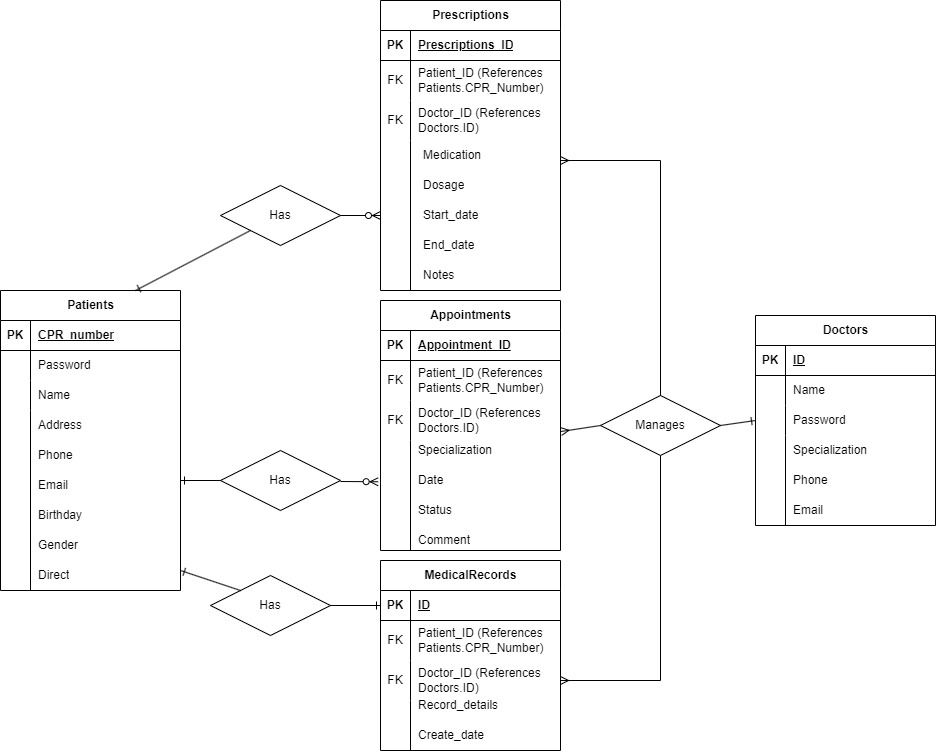

# Unfinished Bank Project: UIS_Prototype
## usage
The Medical Clinic Management System is a web application built with Python and the Flask framework, designed to streamline operations within a medical clinic. It offers roles for both patients and doctors, providing functionalities for managing appointments, medical records, prescriptions, and more.

    git repository:  https://github.com/Benyberg11/DIS_Project_1


## Clone the Repository:
    ```
    git clone https://github.com/Benyberg11/DIS_Project_1
    cd DIS_Project_1
    ```

## Requirements:
Run the code below to install the necessary modules.

    pip install -r requirements.txt


#### notes. When solving codepage problems 
For WINDOWS: Loading data into postgres using psql needs a codepage set. Invoking a cmd shell like this set the codepage: 

    cmd /c chcp 65001   

This makes a subshell with the codepage set to UTF8. 'cmd /c chcp 1252' makes a subshell with the codepage set to 1252. The requirements may have to be run again in the subshell. And you might also have to run the requirements again when invoking a virtual environment (see below). 

## Database init
1. set the database in __init__.py file.
2. run schema.sql, schema_ins.sql, schema_upd.sql in your database
3. run sql_ddl/ddl-patients-001-add.sql in your database.

Example: 

    psql -d{database} -U{user} -W -f schema.sql
   
#### notes
For Ubuntu add host (-h127.0.0.1) to psql: 

    psql -d{database} -U{user} -h127.0.0.1 -W -f schema.sql

## Running flask
### The python way

    python3 run.py

### The flask way.

    export FLASK_APP=run.py
    export FLASK_DEBUG=1           (Replaces export FLASK_ENV=development)
    export FLASK_RUN_PORT=5004     (Optional if you want to change port numbe4. Default port is port 5000.)
    flask run

#### notes
For Windows you may have to use the SET command instead of EXPORT. Ex set FLASK_APP=run.py; set FLASK_DEBUG=1; flask run. Also remeber to add the path to your postgres bin-directory in order to run (SQL interpreter) and other postgres programs in any shell.


### The flask way with a virual environment.

Set up virtual environment as specified in https://flask.palletsprojects.com/en/1.1.x/installation/ (OSX/WINDOWS)
vitualenv may be bundled with python.

#### OSX: 

    mkdir myproject
    cd myproject

Create virtual environment in folder

    python3 -m venv .venv

Activate virtual environment in folder

    . .venv/bin/activate

Install flask

    pip install Flask

Set environment variables and start flask

    export FLASK_APP=run.py
    export FLASK_DEBUG=1           (Replaces export FLASK_ENV=development)
    export FLASK_RUN_PORT=5000     (Optional if you want to change port number. Default port is port 5000.)
    flask run

#### WINDOWS:

Create virtual environment in folder

    mkdir myproject
    cd myproject
    py -3 -m venv .venv

Activate virtual environment in folder

    .venv\Script\activate
    pip install Flask

Set environment variables and start flask

    set FLASK_APP=run.py
    set FLASK_DEBUG=1           (Replaces export FLASK_ENV=development)
    set FLASK_RUN_PORT=5000     (Optional if you want to change port number. Default port is port 5000.)
    flask run

### Consolidated User Stories

This document provides an overview of all main user stories for both patient and doctor roles. For detailed logs and sprints, refer to `cm-log/cm-back-log-consolidated.md` and `cm-log/cm-sprint-log.md`, collectively referred to as the sprint-log-history.

#### Patient Role:

- **PAT1 (logging-on)**: As a patient, I can log in and log out of the system, ensuring my medical information is secure and accessible only to me.
- **PAT2 (view-appointments)**: As a patient, I can view my scheduled appointments with doctors, allowing me to manage my visits effectively.
- **PAT3 (view-medical-records)**: As a patient, I can view my medical records to keep track of my health history.
- **PAT4 (schedule-appointments)**: As a patient, I can schedule an appointment with a doctor, allowing me to manage my consultations.
- **PAT5 (cancel-appointments)**: As a patient, I can cancel my appointments if necessary.
- **PAT6 (view-prescriptions)**: As a patient, I can see my current prescriptions to manage my medication effectively.
- **PAT7 (password-management)**: As a patient, I can reset my password via email and change my password within the system, ensuring account security.

#### Doctor Role:

- **DOC1 (logging-on)**: As a doctor, I can log in and log out of the system, ensuring secure access and updates to patient information.
- **DOC2 (schedule-appointments)**: As a doctor, I can schedule appointments for patients, managing my consultation timings effectively.
- **DOC3 (manage-patients)**: As a doctor, I can add new patients to the system, ensuring they are registered and can receive care.
- **DOC4 (edit-medical-records)**: As a doctor, I can edit parts of a patient's medical journal if I am treating them, keeping their records up to date.
- **DOC5 (view-appointments)**: As a doctor, I can see my appointments with patients, ensuring I am prepared for my consultations.
- **DOC6 (view-medical-records)**: As a doctor, I can view the medical records of my patients to review their medical history and provide better care.
- **DOC7 (prescribe-medication)**: As a doctor, I can prescribe medication to patients, managing their treatments effectively.
- **DOC8 (cancel-appointments)**: As a doctor, I can cancel appointments if necessary.
- **DOC9 (manage-prescriptions)**: As a doctor, I can view and cancel patient prescriptions, ensuring their medication plans are up to date.
- **DOC10 (remove-patients)**: As a doctor, I can remove patients from the system, ensuring only active patients are managed.
- **DOC11 (password-management)**: As a doctor, I can reset my password via email and change my password within the system, ensuring account security.

# Medical Clinic Management System

## Overview
The Medical Clinic Management System is a web application built with Python and Flask. It provides functionalities for both patients and doctors to manage medical records, appointments, and prescriptions.

## How to Compile (alternative, worked for me, just follow each step precisly)

To get the project up and running, follow these steps:

1. **Clone the Repository**
    ```
    git clone https://github.com/Benyberg11/DIS_Project_1
    cd DIS_project
    ```

2. **Set Up Virtual Environment**
    ```
    python -m venv .venv
    Set-ExecutionPolicy -Scope CurrentUser -ExecutionPolicy RemoteSigned
    .venv\Scripts\activate
    pip install -r requirements.txt
    ```

3. **Initialize the Database**
    ```
    psql -d {database} -U {username} -W -f clinic/schema.sql
    psql -d {database} -U {username} -W -f clinic/schema_ins.sql
    psql -d {database} -U {username} -W -f clinic/schema_upd.sql
    ```

4. **Run the Application**
    ```
    flask --app run.py run
    ```

## How to Interact with the Web App

### Logging In

#### For Patients
1. **Access the Login Page**: Navigate to the login page for patients.
2. **Enter Credentials**: Input your CPR number and password. Use test accounts (CPR numbers 1001 to 1005 with the password '1').
3. **Forgot Password**: Enter your email to receive a simulated password reset link.
4. **Direct Login**: Use the direct login feature for test accounts 1001 or 1002 without needing a password.

#### For Doctors
1. **Access the Login Page**: Navigate to the login page for doctors.
2. **Enter Credentials**: Input your doctor ID and password. Use test accounts (doctor IDs 1 to 5 with the password '1').
3. **Forgot Password**: Enter your email to receive a simulated password reset link.

### Navigating the Site

#### For Patients
- **View Appointments**: See scheduled appointments.
- **View Medical Records**: Track health history.
- **Schedule Appointments**: Book new appointments with doctors.
- **Cancel Appointments**: Cancel upcoming appointments.
- **View Prescriptions**: See current medication details.
- **Change Password**: Update your password.

#### For Doctors
- **Dashboard**: Overview of patients, appointments, medical records, and prescriptions.
- **Manage Patients**: Add new patients (medical records not auto-created).
- **View and Edit Medical Records**: View and update patient medical records.
- **View Appointments**: See scheduled appointments with patients.
- **Schedule Appointments**: Book appointments for patients.
- **Cancel Appointments**: Cancel upcoming appointments.
- **Prescribe Medication**: Add prescriptions for patients.
- **Manage Prescriptions**: View and cancel prescriptions.
- **Remove Patients**: Delete patients and their associated records.
- **Change Password**: Update your password.

For detailed interaction instructions, see 

## E/R Diagram


To enhance the documentation of your Medical Clinic Management System project with a development section highlighting areas for potential improvement and future development, you can integrate suggestions regarding the functionality related to password management, patient addition, and other features. Here's a structured way to add this information under a new section titled **Development Opportunities**:

---

## Development Opportunities

This section outlines potential enhancements and feature developments that could significantly improve the usability and functionality of the Medical Clinic Management System. These enhancements are suggestions based on current system capabilities and user feedback.

### 1. Password Management Enhancement
- **Current State**: The system currently lacks a real-time password reset functionality. Patients and doctors can initiate a password reset, but the system does not actually send an email link for password resetting.
- **Proposed Enhancement**: Implement a fully functional password reset feature that sends a reset link to the user's registered email. This will enhance security and user convenience by allowing users to independently manage their login credentials.

### 2. Integration of Medical Journals at Patient Registration
- **Current State**: When doctors add new patients to the system, these patients are registered without a corresponding medical journal being created automatically.
- **Proposed Enhancement**: Modify the patient addition workflow to automatically generate a medical journal whenever a new patient is registered. This would streamline the process for doctors and ensure that each patient's medical records are immediately ready for entries.

### 3. Extended Usability Features
- **Current State**: The system provides basic functionalities required for managing medical clinic operations but lacks several usability features that could enhance user experience, only the sky is the limit!